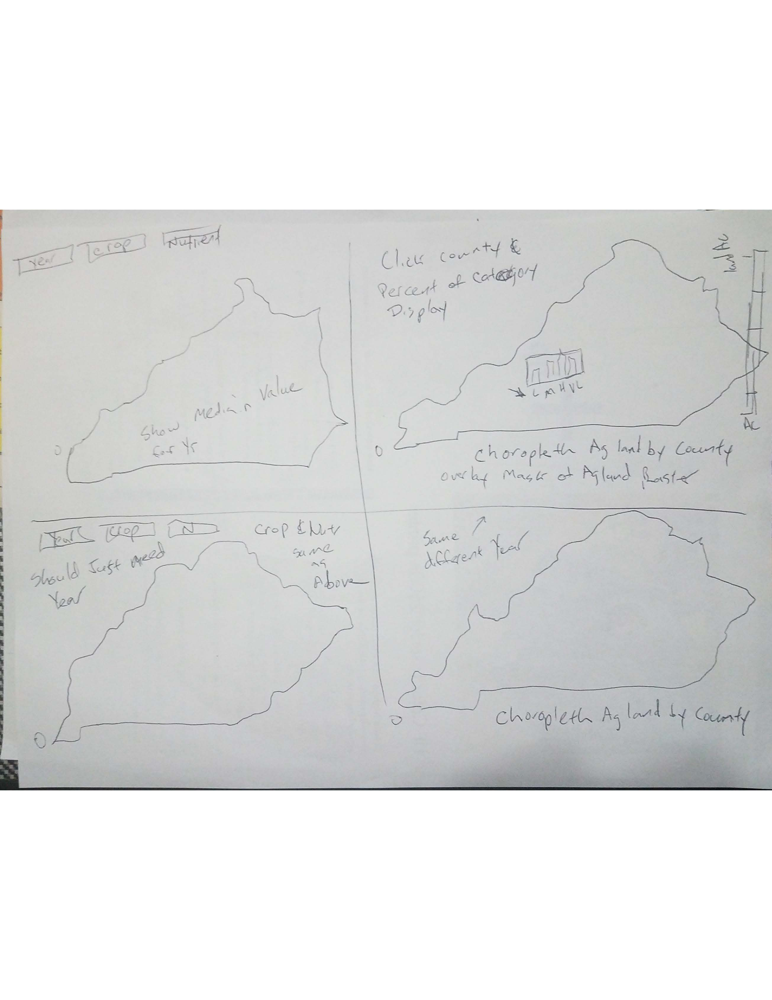

# University of Kentucky's soil test data analysis of phosphorus and potassium against AGR-1 recommendations.
Masters project for New Maps Plus program at the University of Kentucky.

## TOC
- [Introduction](#introduction)
- [Methodology](#methodology) 
     - [Data](#data)
     - [Medium for Delivery](#Medium_for_Delivery)
     - [Application Layout](#application_layout)
     - [Thematic Representation](#thematic_representation)
     - [User Interaction](#User_Interaction)
     - [Aesthetics and Design Considerations](#Aesthetics_and_Design_Considerations)
- [Conclusion](#conclusion)
- [Thanks](#thanks)
- [Literature Review](#literature_review)

## Introduction
Soil nutrient test values are invaluable to farmers and homeowner to create the most productive growing conditions for crops or grasses in the backyard. The [University of Kentucky College of Agriculture](http://www.rs.uky.edu/soil/TestingService.php) offer testing for Kentucky residents through their local [County Extension Office](http://extension.ca.uky.edu/county) so people are not blindly applying unneeded nutrients that will lead to environmental pollution. Nutrient recommendations can be found in [AGR-1](http://www2.ca.uky.edu/agcomm/pubs/agr/agr1/agr1.pdf) for crops and [AGR-53](http://www.uky.edu/WaterResources/FF/Nutrient%20Management/pdf/Lawn%20Fertilizer%20in%20Kentucky.pdf) for lawns. Most farmers collect soil samples on a three year rotation from their fields to verify soil nutrient values are adequate for the growing crop. In recent years farmers have started to question whether AGR-1 recommendations have kept up with the new high yielding hybrids crops and nutrient recommendations should be higher for these production systems.  

Using the University soil test data from 1990 to 2019, we are going to look for trends in phosphorus(P) and potassium(K) data. This data will be used create a Kentucky map showing P and K categories using AGR-1 and have user interactives to select year and nutrient of interest. Also have bar graph showing category frequencies across counties. This map will help farmers, extension agents, and agronomist understand whether AGR-1 recommendations are potentially not on par with high yielding cropping systems. Include USDA AG Census data on crop yield and crop acreage by county. 

## Methodology
Use the Grand Soil Database from the University of Kentucky's Soil test lab to extract P and K from agricultural fields using crop types. This data will create an interactive map showing trends in the nutrients. The median for each County will be calculated by the year and AGR-1 category median will be calculated for each.

### Data

#### Links
1. University of Kentucky [AGR-1 Lime and Nutrient Recommendations](http://www2.ca.uky.edu/agcomm/pubs/agr/agr1/agr1.pdf)

2. [University of Kentucky Soil Testing Lab](http://www.rs.uky.edu/soil/) private data

3. Kentucky's State, Counties, and Regions download from [Kentucky Geological Survey](https://www.uky.edu/KGS/gis/bounds.htm) 
    Metadata:
    *  [State KY](https://www.uky.edu/KGS/gis/ky.htm)
    *  [Regions of Kentucky](https://www.uky.edu/KGS/gis/regions.htm)

4. [United States Department of Agriculture National Agricultural Statistics Service](https://www.nass.usda.gov/Data_and_Statistics/index.php) 
Use [CropScape](https://nassgeodata.gmu.edu/CropScape/) map to download Kentucky crop mask layer

#### Tools used in Data Wrangling
1. Create a CSV file from the University's Grand database which is a Microsoft Access database file.
    - use Access query to select County data only
    - export query as a CSV file with header
    - add County FIPS code
2. Separate data into crop type using AGR-1 crop types use Python/Jupyter Notebook with pandas.
    - Tobacco, Corn, Soybeans, Small Grains, Grain Sorghum, Canola, Hay/Pasture
    - some data overlaps more than one category example: wheat/soybeans
    - create pivot table using FIPS code as rows  
3. Boundary files simplified with [mapshaper](https://mapshaper.org/)
    * County boundary simplified 15.0% and export as GeoJSON file
#### Example of Data
#### Raw data example
FIPS_NO  YEAR FM COUNTY                AREA    PH  BUPH      P      K  \
0       1  1990  A  ADAIR  Eastern Pennyroyal  7.15  7.23   28.0  158.0   
1       1  1990  A  ADAIR  Eastern Pennyroyal  6.95  7.22   88.0  134.0   
2       1  1990  A  ADAIR  Eastern Pennyroyal  6.26  6.94   70.0  256.0   
3       1  1990  A  ADAIR  Eastern Pennyroyal  5.67  6.69  161.0  611.0   
4       1  1990  A  ADAIR  Eastern Pennyroyal  7.26  7.47  105.0  315.0   

      CA      MG   ZN  ACRES     CROP  
0      NaN     NaN  NaN   18.0  Alfalfa  
1  2890.00  159.00  NaN   15.0  Alfalfa  
2      NaN     NaN  NaN   16.0  Alfalfa  
3      NaN     NaN  NaN    6.0  Alfalfa  
4  2940.00  137.00  NaN   25.0  Alfalfa  

#### Clean data with null values removed county  
  RangeIndex: 958826 entries, 0 to 958825
  Data columns (total 10 columns):
  FIPS_NO    958826 non-null object
  COUNTY     958826 non-null object
  AREA       958826 non-null object
  YEAR       958826 non-null object
  CROP       958826 non-null object
  ACRES      517097 non-null float64
  PH         958813 non-null float64
  BUPH       854104 non-null float64
  P          958826 non-null float64
  K          958826 non-null float64
  dtypes: float64(5), object(5)
  memory usage: 73.2+ MB

  #### Data with median for categories calculated
  COUNTY  count_1990_H  count_1990_L  count_1990_M  count_1990_VL  \
0     ADAIR            15             4            11              0   
1     ALLEN             7            10             6              0   
2  ANDERSON            10             3             1              1   
3   BALLARD            69             0            12              0   
4    BARREN            66             9            26              0   

count_1991_H  count_1991_L  count_1991_M  count_1991_VL  count_1992_H  ...  \
0            24             7             4              0            18  ...   
1            19             4            18              0             9  ...   
2            18             3             9              0             9  ...   
3            33             4            28              0            51  ...   
4            86             9            45              0           114  ...   

2017_M  2017_VL  2018_H  2018_L  2018_M  2018_VL  2019_H  2019_L  2019_M  \
0    44.0        0   140.0    20.0    42.0        0   104.0    24.0    43.0   
1    36.0        0   116.0     0.0    34.0        0   312.0    16.0    38.0   
2     0.0        0   147.0     8.0    30.0        0   248.0     0.0    51.0   
3    42.0        0    74.0     0.0    37.0        0    74.0    24.0    46.0   
4    58.0        0   108.0    24.0    45.0        0   133.0    20.0    45.0   

2019_VL  
0        2  
1        0  
2        0  
3        0  
4        2  

[5 rows x 241 columns]
  COUNTY  count_1990_H  count_1990_L  count_1990_M  count_1990_VH  \
0     ADAIR             3            12            12              1   
1     ALLEN             2             6            13              1   
2  ANDERSON             4             5             3              2   
3   BALLARD            20            10            48              3   
4    BARREN            32            16            26             26   

count_1990_VL  count_1991_H  count_1991_L  count_1991_M  count_1991_VH  \
0              2             5            12            12              4   
1              1            11             7            18              5   
2              1             9             6            11              4   
3              0            11            17            35              2   
4              1            35            23            62             19   

...  2018_H  2018_L  2018_M  2018_VH  2018_VL  2019_H  2019_L  2019_M  \
0  ...   346.0   156.0   237.0    455.0     91.0   336.0   160.0   234.0   
1  ...     0.0     0.0   234.0      0.0     95.0     0.0   140.0   217.0   
2  ...     0.0   174.0   216.0    502.0     96.0     0.0   181.0   209.0   
3  ...   309.0   168.0   222.0    509.0      0.0   387.0   164.0   211.0   
4  ...   339.0   184.0   243.0    451.0      0.0   358.0   162.0   219.0   

2019_VH  2019_VL  
0      0.0     78.0  
1      0.0     86.0  
2    543.0      0.0  
3      0.0      0.0  
4    422.0     90.0  

[5 rows x 301 columns]

### Medium_for_Delivery
The delivery method will be webpage that is accessible across multiple platforms (ex. desktop and mobile devices).

### Application_Layout
The general layout will be four maps separated into quadrants on the page. The quadrant layout will be suite for computer displays. The mobile layout will cascade down the page with four individual maps. The first map will have choropleth of the median value of the nutrient. The second map will have mask of agricultural land with classified colors representing total agricultural land by county. The third and fourth map will be repeat of the first two but represent different year to allow for comparison.

### Thematic_Representation
The data is representing County level soil testing so polygons will be classified by median value. Also land mask of the agricultural will be display so total landuse in agriculture is represented so visual comparisons can be made for how much ag is in each county.  

### User_Interaction
The user interaction will be with dropdown menus with selection for Year, Crop type, and Nutrient (P or K). The third map will also allow for the selection of a different year to compare data. The second map will allow the user to hover or click county to display the number of test for that county for the year. Also there will be a popup bargraph showing percentages of each categories in the county along with the median value for each category. Here is mock layout of the webpage design.

### Aesthetics_and_Design_Considerations

### Conclusion

### Thanks
I would like to thanks several people for helping with this project: Dr. Rich Donohue, Dr. Edwin Ritchey, Dr. Frank Sikora, Dr. Joshua McGrath, and Mark Cruse

### Literature_Review
1. Nutrient Use Geographic Information System [NuGIS](http://nugis.ipni.net/About%20NuGIS/)
    - interactive map to select nutrient inputs displayed as point data
    - can select watershed nutrient balance
2. [Bay out of Balance](https://www.ewg.org/sites/default/files/report/bay_out_of_balance_full_report.pdf)
    -  examples of mapping phosphorus in soils see Appendix C
3.    [County-Level Estimates of Nutrient Inputs to the Land](https://pubs.usgs.gov/sir/2006/5012/pdf/sir2006_5012.pdf)
    - Nitrogen inputs from manure and fertilizer  temporal patterns
4. [Potential for Livestock and Poultry Manure to Provide the Nutrients Removed by Crops and Forages in Kentucky](http://www2.ca.uky.edu/agcomm/pubs/ip/ip57/ip57.pdf)
    - Counties are represented by percentage of Nitrogen coming from manure
